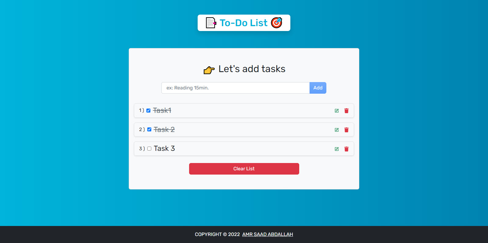
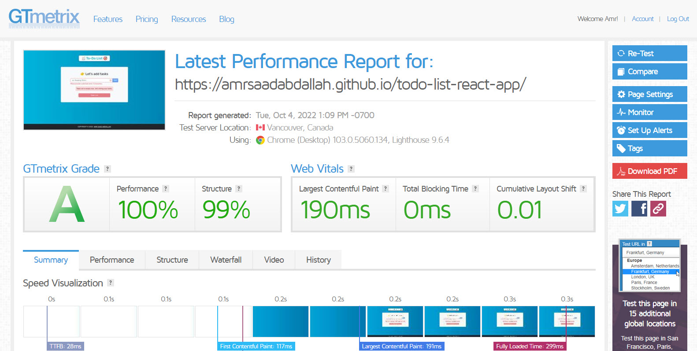

<h1 align="center" > To-Do List  &mdash; React App  </h1>

### 👁️ Project Preview:

- [ Live Preview 👉 https://amrsaadabdallah.github.io/todo-list-react-app](https://amrsaadabdallah.github.io/todo-list-react-app)

- [ Github Repo 👉 https://github.com/amrsaadabdallah/my-todo-list-react-app](https://github.com/amrsaadabdallah/my-todo-list-react-app)
    - 🚩 It's a private repo <a target="_blank" href="mailto:amrsaadabdallah@gmail.com">contact me </a>to see.

---

### 📝 Project Description & features:

- It's a medium react app (To-Do List) used to practice basic react features.
- it's used to add Tasks, edit and delete added tasks.
- After each process (Add, Edit, Delete) there's a notification messgae fires.
- Your entered Tasks is saved at localstorage.
---

### 🛠️ Project Tools:

1. Used Google Fonts.

1. Bootstrap Classes for styling.

1. ReactJS Library.

1. PropTypes package for typechecking component props.

1. Random paragraphs list get from local file called data.

1. [GTmetrix](https://gtmetrix.com/) is an online tool for customers to easily test the performance of their webpages.

---

### :sparkles: Project Skills applied:

1. Create Multiple React Component.

1. Configuration react component by props.

1. Render List of items.

1. Apply Conditional Rendering.

1. Deal with form.

1. Use React Hook (UseState, useEffect).

1. Deal with LocalStorage API to store Tasks.

1. Typechecking component props With PropTypes package.

1. Test the performance of the webpage after deploy by using [GTmetrix](https://gtmetrix.com/).

---

### 🧪 Project performance test:

Test the performance of the webpage after deploy by using [GTmetrix](https://gtmetrix.com/).

---

### 👋 Get In Touch:

- [🌐 Website 👉 https://amrsaadabdallah.github.io](https://amrsaadabdallah.github.io)
- [👔 LinkedIn 👉 https://www.linkedin.com/in/amrsaadabdallah](https://www.linkedin.com/in/amrsaadabdallah)
- [🌟 Github 👉 https://github.com/amrsaadabdallah](https://github.com/amrsaadabdallah)
- [📧 Gmail 👉 amrsaadabdallah@gmail.com](mailto:amrsaadabdallah@gmail.com)
- [🐤 Twitter 👉 https://twitter.com/amrsaadabdallah](https://twitter.com/amrsaadabdallah)
- [:phone: Whatsapp 👉 (+20) 109-775-6067](https://api.whatsapp.com/send/?phone=%2B2001097756067&text&type=phone_number&app_absent=0)

---

<a target="_blank" href="https://amrsaadabdallah.github.io">

 2022 &copy; Amr Saad Abdallah 

</a>

